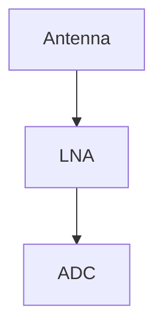

# Writing for the blog

A post is one Markdown file in its own folder. Write it, preview it, push it. GitHub Actions builds and publishes the site.

## Quick start

```bash
mkdir src/content/posts/my-first-post
$EDITOR src/content/posts/my-first-post/index.md
npm run dev            # http://localhost:4321, drafts are visible here
```

The folder name becomes the URL: `src/content/posts/my-first-post/` is published at `/posts/my-first-post/`.
Use lowercase words joined by dashes, and do not rename a folder after publishing (that breaks links).

Minimal `index.md`:

```markdown
---
title: "A short, specific title"
description: "One sentence. It shows in lists, search results and link previews."
date: 2026-10-05
tags: [rust, dsp]
---

Your text starts here.
```

## Frontmatter reference

The frontmatter is validated at build time. A typo fails the build with a message, it never ships.

| Field | Required | Meaning |
| --- | --- | --- |
| `title` | yes | Post title. |
| `description` | yes | One sentence for lists, search and social previews. |
| `date` | yes | Publication date, `YYYY-MM-DD`. |
| `updated` | no | Date of the last substantive revision. Shows a "Revised" line and resets the `[STALE]` clock. Must not be earlier than `date`. |
| `kind` | no | `essay` (default), `devlog` (project log) or `note` (short jotting). Shown as a badge, and filterable in the archive. |
| `tags` | no | Lowercase words joined by dashes: `[rust, homelab, noise-figure]`. Each tag gets a page at `/tags/<tag>/`. |
| `project` | no | The id of a project from `src/data/projects.yaml` (for example `sdrtop`). The post then appears on that project's page. |
| `series` | no | A series name, spelled the same in every part. Needs `seriesOrder`. |
| `seriesOrder` | with `series` | Position in the series: 1, 2, 3, ... |
| `cover`, `coverAlt` | no | Reserved for a cover image; `coverAlt` is required when `cover` is set. Social cards are generated automatically for now. |
| `draft` | no | `true` hides the post from the published site. |
| `evergreen` | no | `true` switches off the `[STALE]` banner (see below). |
| `toc` | no | `false` hides the table of contents. It appears by default when a post has three or more `##`/`###` headings. |

## The publishing flow

1. Write with `draft: true` while you work. Drafts show in `npm run dev` and stay off the live site.
2. Remove `draft: true` (or set it to `false`) when it is ready.
3. Run the checks: `npm run verify` (type check, build, link check, contrast check).
4. Commit and push to `main`. The deploy workflow publishes it within a couple of minutes.

To see drafts in a real build: `SHOW_DRAFTS=1 npm run build && npm run preview`.

## Markdown features

Everything is plain Markdown. Posts stay readable on GitHub and in any editor.

### Text, lists, tables, footnotes

```markdown
**bold**, *italic*, ~~strikethrough~~, `inline code`, <kbd>Ctrl</kbd> + <kbd>K</kbd>, <mark>highlight</mark>, H<sub>2</sub>O

- [x] A task list item
- [ ] Another one

| Device     | Range         |
| ---------- | ------------- |
| HackRF One | 1 MHz – 6 GHz |

A sentence with a footnote.[^1]

[^1]: The footnote text, with a link back to the sentence.
```

Wide tables scroll sideways on small screens. `<details><summary>...</summary>...</details>` gives a collapsible section.

### Callouts

Same syntax as GitHub, so the post also looks right there. Kinds: `NOTE`, `TIP`, `IMPORTANT`, `WARNING`, `CAUTION`.

```markdown
> [!WARNING]
> Body text. Markdown works inside.

> [!TIP] A custom title
> Put the title after the marker.
```

### Math

KaTeX, rendered at build time. A formula that does not parse **fails the build**, so mistakes cannot ship.

```markdown
Inline: the noise floor is $N = k T B$.

$$
X_k = \sum_{n=0}^{N-1} x_n \, e^{-i 2\pi k n / N}
$$

Units: $P = -97\,\mathrm{dBm}$
```

### Code

Fenced blocks are highlighted, get a copy button, and support a few extras in the info string:

````markdown
```rust title="src/main.rs" {2} ins={4} del={3} showLineNumbers
fn main() {
    let x = 1;
    println!("old");
    println!("new");
}
```

```bash
$ cargo build --release
```

```diff
- removed
+ added
```
````

`title="..."` adds a file name tab, `{2}` highlights line 2, `ins={..}` and `del={..}` mark added and removed lines, `showLineNumbers` numbers the lines. Shell blocks (`bash`, `sh`) get a terminal frame.

### Diagrams

Mermaid, drawn in the browser. Without JavaScript the readable source stays visible.

````markdown

````

Prefer `TD` (top to bottom) for longer flows: a wide diagram scrolls sideways instead of shrinking. Diagrams follow the light and dark theme. See the note on performance below.

### Images

Keep the image next to `index.md` and use a relative path. The build converts it to an optimized `webp` with the right size attributes.

```markdown

```

- The text in `[...]` is the **alt text**: describe what the image shows. Always write it.
- The optional quoted title becomes the visible caption.
- Images that are shown smaller than their real size open in a lightbox on click. Export at up to about 1600 px wide.

## Series, projects, tags

- **Series:** give every part the same `series` name and its own `seriesOrder`. Each part gets a "part N of M" box, and previous/next follow the series order.
- **Projects:** add an entry to `src/data/projects.yaml` (`name`, `tagline`, `description`, `repo`), then set `project: <id>` in posts. Devlogs work well as `kind: devlog`.
- **Tags:** keep the vocabulary small. Reuse existing tags (`/tags/` lists them) before inventing new ones.

## Old posts and `[STALE]`

A post older than 18 months (measured from `updated`, or `date` if there is no `updated`) gets a `[STALE]` banner warning that versions and commands may have drifted. The site is rebuilt weekly so the banner appears on its own.

- Revised the post? Set `updated:` to today and the clock restarts.
- A timeless piece (an essay, a philosophy)? Set `evergreen: true`.

## Search

Search indexes the article body. The index is rebuilt by `npm run build`. In `npm run dev` the search uses the index from the last build, so run `npm run build` once to have something to search, and again to refresh it.

## Performance notes

- **Diagrams cost JavaScript.** The Mermaid library is only downloaded on posts with a diagram, and only when the diagram is about to scroll into view. A diagram in the very first screen of a post is drawn immediately, and on a slow phone that shows up as a layout shift and a short freeze. If it matters, put the diagram a little further down.
- **Keep images reasonable.** A 5 MB screenshot is optimized, but the original still lives in the repository.

## Removing the sample content

The first posts (`hello-bench` and the two `blog-devlog-*` posts) are placeholders written while building the blog, marked with a `SAMPLE POST` comment. Replace or delete those folders. The `kitchen-sink` post is a draft used to test every feature: keep it, it is the quickest way to check that a change did not break anything.

## When something looks stale or broken

- **Old output after changing a plugin or the code-block config:** delete `.astro/` and restart `npm run dev`. Rendered Markdown is cached by content.
- **In hand-written `.astro` files** (not posts), put `{' '}` before an inline element that starts a new line, otherwise the space before it is dropped.
- **Build fails on math or frontmatter:** the error names the file and the problem. Fix it and rebuild.
