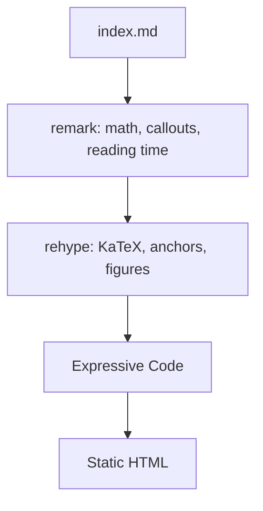

<!-- SAMPLE POST: a placeholder written with the blog. Replace it with your own writing, or delete this folder. -->

Every post is a single `index.md`. Everything fancy has to come from that file, so the pipeline does the heavy lifting.

## How a post is built



Math is rendered at build time, so readers never download a math engine. A broken formula fails the build:

$$
\mathrm{SNR}_\text{dB} = 10 \log_{10}\frac{P_\text{signal}}{P_\text{noise}}
$$

Code blocks get titles, line marks and a copy button:

```rust title="src/main.rs" {2}
fn main() {
    println!("hello, bench");
}
```

## The gotcha

> [!WARNING]
> Astro 7 defaults to a new Rust-based Markdown processor. The remark and rehype plugin ecosystem still runs on the `unified` processor, which is a separate package you have to install and opt into.

The symptom is a config error the moment you add `remarkPlugins`. The fix is one import from `@astrojs/markdown-remark` and passing the plugins to `unified({...})`.

A second one: rendered Markdown is cached by its content. Change a plugin and the cache happily serves the old output until you delete `.astro/`.
