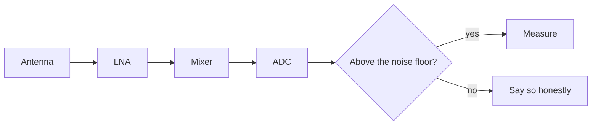
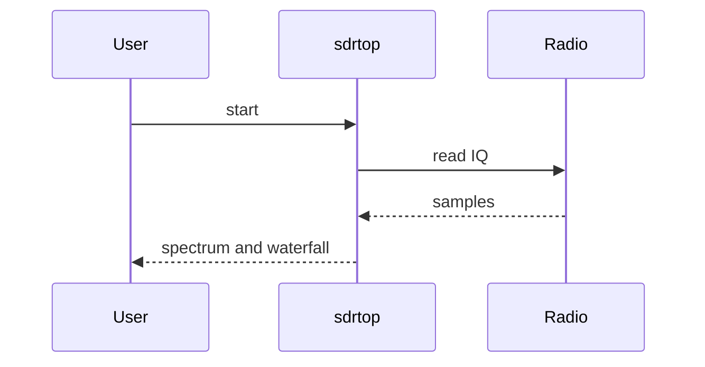
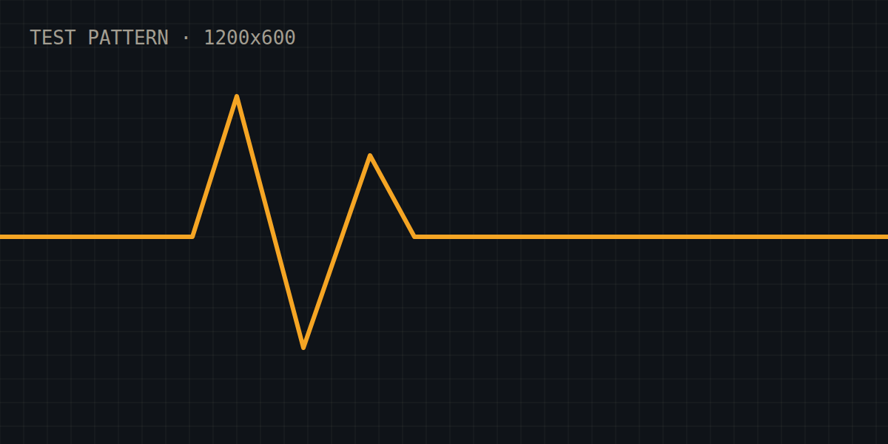

This post is the test bench for the blog itself. If something looks wrong here, it will look wrong everywhere. It is a draft, so it only shows up in `npm run dev`, or in a build with `SHOW_DRAFTS=1`.

## Text and inline formatting

Plain text with **bold**, *italic*, ***both***, ~~strikethrough~~, `inline code`, and a [link to the repo](https://github.com/musithang/sdrtop). Keyboard shortcuts look like <kbd>Ctrl</kbd> + <kbd>K</kbd>, and <mark>highlighted text</mark> stands out. Chemistry gets H<sub>2</sub>O, physics gets E = mc<sup>2</sup>.

Hungarian letters must survive everything: árvíztűrő tükörfúrógép, Laszló, ŐŰ. Smart "quotes" and dashes -- like this --- and an ellipsis...

An autolinked URL: https://musithang.github.io and a footnote reference.[^1]

### A third-level heading

#### A fourth-level heading

> A blockquote. Because the only thing worse than no data is confidently wrong data.
>
> With a second paragraph.

---

## Lists

- An unordered item
- Another item
  - A nested item
  - And one more
- Back at the top

1. First
2. Second
   1. Nested and numbered
3. Third

Task list:

- [x] Write the pipeline
- [x] Test the pipeline
- [ ] Trust the pipeline

## Callouts

> [!NOTE]
> Useful information that users should know, even when skimming.

> [!TIP]
> Helpful advice for doing things better or more easily.

> [!IMPORTANT]
> Key information users need to know to achieve their goal.

> [!WARNING]
> Urgent info that needs immediate user attention to avoid problems.

> [!CAUTION] Custom title on a caution
> Advises about risks or negative outcomes of certain actions. This one has **formatting**, `code`, and a second paragraph.
>
> Second paragraph inside the callout.

## Tables

| Device       | Range         | ADC    | Notes                                                                 |
| ------------ | ------------- | :----- | --------------------------------------------------------------------- |
| HackRF One   | 1 MHz – 6 GHz | 8-bit  | Half-duplex, plenty of fun, and a note long enough to force scrolling |
| RTL-SDR      | 24 – 1766 MHz | 8-bit  | Cheap and cheerful                                                    |
| tinySA Ultra | 100 kHz – 6 GHz | n/a  | A spectrum analyzer, so a different beast                             |

## Math

Inline math sits in the text: the noise floor of a receiver is $N = k T B$, and a sine wave is $x(t) = A\sin(2\pi f t + \varphi)$.

A display equation, the discrete Fourier transform:

$$
X_k = \sum_{n=0}^{N-1} x_n \, e^{-i 2\pi k n / N}
$$

Something with alignment, a noise figure chain (Friis formula):

$$
\begin{aligned}
F_\text{total} &= F_1 + \frac{F_2 - 1}{G_1} + \frac{F_3 - 1}{G_1 G_2} + \cdots \\
NF_\text{dB} &= 10 \log_{10} F_\text{total}
\end{aligned}
$$

Units in text mode: $P = -97\,\mathrm{dBm}$ at $f = 433.92\,\mathrm{MHz}$.

## Code

Inline `Result<T, E>` and a Rust block with a title, line marks, and inserted/deleted lines:

```rust title="src/main.rs" {2} ins={5} del={4}
fn main() {
    let samples: Vec<f32> = read_iq("capture.cf32");
    let mean = samples.iter().sum::<f32>() / samples.len() as f32;
    println!("mean = {mean}");
    println!("mean = {mean:.3}");
}
```

A shell session gets a terminal frame:

```bash
$ cargo build --release
   Compiling sdrtop v0.1.0
    Finished release [optimized] target(s) in 41.2s
```

Line numbers on request:

```python showLineNumbers
def db(x: float) -> float:
    """Power ratio to decibels."""
    return 10 * math.log10(x)
```

A plain diff:

```diff
- old behaviour
+ new behaviour
```

A very long line to check horizontal scrolling on small screens:

```text
0123456789 0123456789 0123456789 0123456789 0123456789 0123456789 0123456789 0123456789 0123456789 0123456789
```

## Diagrams

A flowchart:



A sequence diagram:



## Images

An image with a caption (the Markdown title becomes the figcaption):



An image without a caption:


## Details and footnotes

<details>
<summary>A collapsed section</summary>

Hidden until opened, and it can contain **Markdown**, `code`, and lists:

- one
- two

</details>

Another footnote for good measure.[^note]

[^1]: The first footnote. It links back to where it was referenced.

[^note]: A second footnote, with `code` in it.
